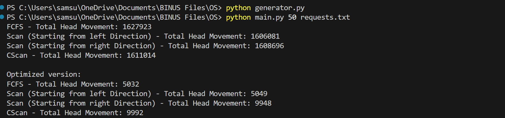

# Disk Scheduling

This assignment implements three disk scheduling algorithms: FCFS (First-Come, First-Served), SCAN (Elevator Algorithm), and C-SCAN (Circular SCAN). These algorithms manage the order in which disk I/O requests are serviced to optimize performance.

# Algorithms

### 1. FCFS (First-Come, First-Served)
The FCFS algorithm services disk I/O requests in the order they arrive.

### 2. SCAN (Elevator Algorithm)
The SCAN algorithm, also known as the Elevator Algorithm, moves the disk arm in one direction, servicing all requests until it reaches the end of the disk. It then reverses direction and services requests on the way back.

### 3. C-SCAN (Circular SCAN)
The C-SCAN algorithm is similar to SCAN but treats the disk as a circular list. When the disk arm reaches the end of the disk, it quickly returns to the beginning without servicing any requests on the return trip. 
## 1st Step: Random Number Generator for the requests file.

To run the generator, run the following command

```
  python generator.py
```
### OR

To run the generator with a fixed randomness (using seed), run the following command. For example, first argument as a seed which is 42.

```
  python generator.py 42
```
## 2nd Step: Running the test for each algorithm

To run the test, run the following command. For example, 42 as the initial position of the diskhead while requests.txt is the file path. In this program, it needs two argument to ensure that it is working correctly.
```
  python main.py 42 requests.txt
```

## Test Result



